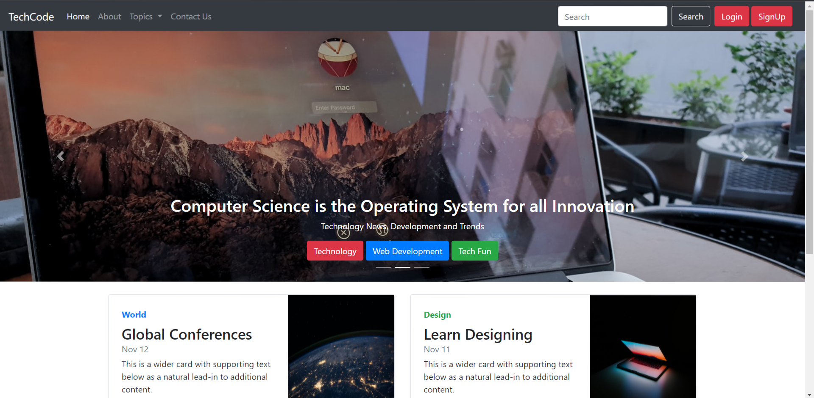
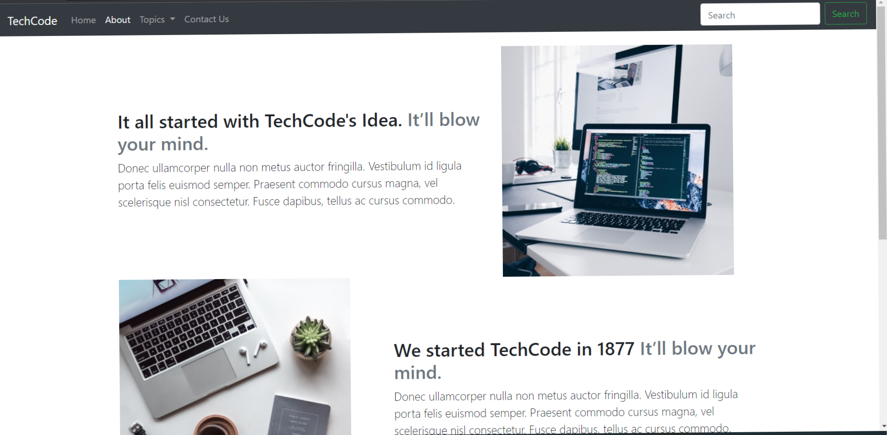
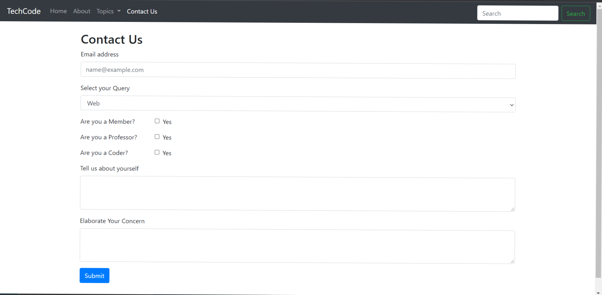

# Blog Site :sparkles:

To view a demo example, [**`Click Here`**](https://ashishkarki21.github.io/Blog_Site/)

This is a Basic Website Focussed On Frontend development

The project use Bootstrap and it consists of the following pages:

- Homepage [check code](https://github.com/Ashishkarki21/Blog_Site/blob/main/index.html)
- About [check code](https://github.com/Ashishkarki21/Blog_Site/blob/main/about.html)
- Contact [check code](https://github.com/Ashishkarki21/Blog_Site/blob/main/contact.html)





## :rocket: How to use

1. Make a clone :

```sh
  $ git clone https://github.com/Ashishkarki21/Blog_Site.git
```

2. Add your information in the above page files

## ✨ Contributing

1. Fork this repository
2. Improve current code by:
    - improving the style
    - adding new feature
    - improving the documentation
3. Push your work and create a Pull Request
